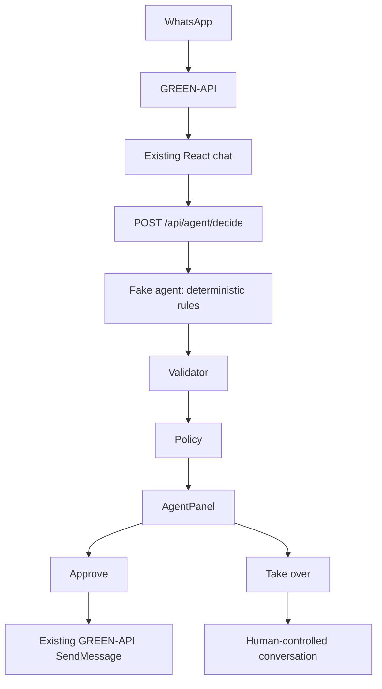

# WhatsApp Agent Console

React-клиент мессенджера для WhatsApp на GREEN-API. Проект использует JavaScript
и Vite и поддерживает только текстовые сообщения. Интерфейс состоит из списка
чатов слева, выбранного диалога и панели предлагаемых агентом действий.
Первый этап Agent Console использует детерминированный fake-agent и требует
решения оператора перед отправкой любого предложенного ответа.

## Возможности

- Ввод `idInstance` и `apiTokenInstance` в интерфейсе.
- Проверка подключения к GREEN-API перед открытием мессенджера.
- Создание нового чата по номеру телефона.
- Отправка текстовых сообщений.
- Получение входящих текстовых сообщений.
- Список созданных чатов и диалогов с полученными сообщениями.
- Переключение между чатами с отдельной историей каждого диалога.
- Обработка ошибок подключения, номера, отправки и получения.
- Автоматический повтор получения после временных ошибок.
- Предложение ответа fake-agent, проверка результата и передача рискованных
  обращений оператору.
- Approve / Take over и журнал решений в памяти.

Данные подключения, список чатов и история хранятся только в памяти страницы.
Выход из приложения или перезагрузка страницы очищают их.

## Требования

- Node.js **22.12+**.
- npm.

## Запуск из GitHub

Клонируйте репозиторий и установите зависимости:

```bash
git clone https://github.com/andrejkorzhenevskij/whatsapp-agent-console.git
cd whatsapp-agent-console
npm install
```

Запустите backend и React в двух терминалах:

```bash
# Терминал 1: Express на http://127.0.0.1:3001
npm run server

# Терминал 2: Vite
npm run dev
```

Откройте адрес из терминала, обычно `http://localhost:5173`.
Для остановки каждого сервера нажмите `Ctrl+C`. Для автоматического перезапуска
backend при изменении файлов используйте `npm run server:dev`.
Vite проксирует `/api` на `http://127.0.0.1:3001` и в dev, и в preview.
Запросы к GREEN-API по-прежнему выполняются непосредственно из браузера.

## Настройка GREEN-API

1. В [личном кабинете GREEN-API](https://console.green-api.com) создайте
   WhatsApp-инстанс на тарифе **Developer**.
2. Авторизуйте WhatsApp для этого инстанса, следуя инструкции в личном кабинете.
3. В настройках инстанса включите «Получать уведомления о входящих сообщениях и файлах»
   (`incomingWebhook`: `yes`).
4. Оставьте поле **Webhook URL** (`webhookUrl`) пустым: приложение получает
   уведомления через HTTP polling.
5. Получите `idInstance` и `apiTokenInstance` в параметрах инстанса.
6. Откройте приложение и введите их в поля «ID инстанса» и «Токен доступа».
7. Нажмите «Открыть чат». Приложение выполняет запрос `GetStateInstance`
   и открывает мессенджер только при состоянии `authorized`.

Если подключение не удалось, проверьте данные, авторизацию WhatsApp и соединение
с интернетом. Приложение не меняет настройки инстанса автоматически.

Бесплатный тариф Developer ограничен одним инстансом и тремя чатами
(контактами или группами). [Условия тарифа](https://green-api.com/en/docs/about-tariffs/).

## Создание чата и отправка сообщения

1. Нажмите **«Новый чат»**.
2. Введите номер получателя в международном формате, например `+380501234567`.
   Допускаются 7–15 цифр с кодом страны, знак `+`, пробелы, дефисы и скобки.
3. Нажмите **«Открыть чат»** в форме. Диалог появится в списке и откроется справа.
4. Введите текст и нажмите **«Отправить»**.

Номер нормализуется локально: `+380 (50) 123-45-67` преобразуется
в `380501234567@c.us`. Создание чата проверяет формат номера, но не наличие
аккаунта WhatsApp. Отправка выполняется методом `SendMessage` с `chatId`
выбранного диалога. Лимит текста — 20000 символов.

После успешного ответа сообщение добавляется в историю, а поле ввода очищается.
При ошибке текст сохраняется для повторной отправки. Ответ API означает принятие
сообщения в очередь, а не подтверждение доставки. Автоматической повторной
отправки нет.

Выбирайте диалоги нажатием в списке слева. Повторное открытие того же номера
выбирает существующий чат. Входящие сообщения отображаются слева, исходящие —
справа; в списке показываются последнее сообщение и время.

## Получение сообщений

Пока мессенджер открыт, приложение последовательно вызывает
`ReceiveNotification`, обрабатывает уведомление и затем подтверждает его
методом `DeleteNotification`. Следующий запрос начинается после завершения
предыдущего и обработки уведомления. Постоянный `setInterval` не используется.

Входящее текстовое сообщение попадает в свой диалог по `senderData.chatId`.
Если такого чата ещё нет, он появляется в списке автоматически.
Повторные уведомления не дублируют историю. Нетекстовые сообщения и служебные
уведомления подтверждаются без добавления в историю; некорректное текстовое
уведомление при ошибке обработки не удаляется.

При временной ошибке получения — сетевом сбое, таймауте или HTTP 429/5xx —
приложение повторяет запрос с паузами 1, 2, 4 и максимум 8 секунд.
Успешный ответ сбрасывает задержку. При ошибке авторизации, формата ответа,
обработки или удаления доступна кнопка ручного повтора.
«Выйти» отменяет активные запросы и ожидание повтора через `AbortController`.

## Human-in-the-loop Agent



Express backend написан на JavaScript. Он принимает текст и контекст диалога,
возвращает решение и ничего не отправляет в WhatsApp. Данные подключения
GREEN-API на backend не передаются. Настоящего LLM, OpenAI API, AI SDK,
дополнительных API keys, базы данных, Redis, authentication, background workers
или Docker на этом этапе нет.

`POST /api/agent/decide` принимает:

```json
{
  "message": "I'd like to book it for Friday.",
  "chatId": "380501234567@c.us",
  "conversation": [
    { "direction": "incoming", "text": "I'd like to book it for Friday." }
  ]
}
```

`conversation` содержит до 100 последних сообщений с полями `direction`
(`incoming` / `outgoing`) и `text`; клиент передаёт только этот контекст.

Пример ответа с шестью обязательными полями:

```json
{
  "action": "qualify",
  "reply": "Happy to help with your booking. What time would you prefer, and how many people should we expect?",
  "leadScore": 72,
  "confidence": 0.91,
  "reason": "The customer expressed clear booking intent.",
  "requiresApproval": false
}
```

Точные тексты ответа задаются правилами в `server/agent.js`. Fake-agent не
генерирует текст через модель. Фразы для демонстрации:

| Входящее сообщение | Результат |
| --- | --- |
| `I'd like to book it for Friday.` | `qualify` |
| `Maybe. How does this work?` | `ask_more` |
| `Refund me immediately or I'll sue.` | `handoff`: risky topic |
| `What does it cost?` | `reply` |
| `I am not sure what I need.` | `handoff`: низкая confidence |
| `Can you give me a special discount?` | `handoff`: requiresApproval |
| `demo:invalid-action` | Невалидное действие преобразуется в `handoff` |

Validator проверяет JSON/object и все шесть полей: `action`, `reply`,
`leadScore`, `confidence`, `reason`, `requiresApproval`. Разрешены только
`reply`, `qualify`, `ask_more`, `handoff`. `leadScore` — целое число от 0 до 100,
`confidence` — конечное число от 0 до 1, `reason` — непустая строка до 2000
символов, `reply` — строка до 20000 символов, непустая для безопасного действия,
`requiresApproval` — boolean. Невалидный результат не становится обычным
предложением в UI.

Policy переводит результат в `handoff` с `requiresApproval: true`, если
confidence меньше `0.75`, запрошено approval, действие уже `handoff`,
обнаружена рискованная тема или проверка validator не прошла. Любой такой
результат блокирует отправку через Approve.

AgentPanel показывает **AGENT DECISION**, Lead score, Confidence, Action,
Reason и Suggested reply. Состояния панели: Ready, Awaiting approval, Approved,
Human takeover и Handoff. Даже безопасное решение с `requiresApproval: false`
локально ожидает оператора в состоянии **Awaiting approval**: автоматической
отправки нет. Approve использует существующий механизм отправки только для
разрешённых `reply` / `qualify` / `ask_more` с непустым reply. При `handoff`
кнопка Approve недоступна.

**Take over** переводит конкретный диалог под контроль человека и ничего не
отправляет. Этот режим сохраняется при переключении между чатами до
перезагрузки страницы или повторного создания chat-компонента. Новые входящие
сообщения в таком диалоге не вызывают fake-agent. Оператор по-прежнему может
писать вручную; ручная отправка делает ожидающее предложение устаревшим,
чтобы его нельзя было одобрить после ответа человека.

Журнал решений виден в панели и хранится только в памяти клиента. Запись
содержит timestamp, chatId, incoming message, decision, confidence, action,
reason, requiresApproval, operator action и resulting action. Он фиксирует
решение, approval / takeover и результат отправки. Backend хранит записи
решений в `app.locals` в памяти процесса; действия оператора записываются
клиентом, поэтому backend-записи остаются с ожидающим operator action.
Перезагрузка страницы очищает клиентский журнал, перезапуск backend — его
журнал. Сохранения в базу данных нет.

## Безопасность

- Credentials (`idInstance` и `apiTokenInstance`) не сохраняются в
  `localStorage` или `sessionStorage` и не выводятся в console.
- Не добавляйте `apiTokenInstance` в Git.
- Не вставляйте реальные credentials в исходники, README или примеры кода.
- Вводите данные подключения только в интерфейсе приложения.

## Проверки и сборка

```bash
npm run lint
npm run check
npm run build
```

- `lint` проверяет JavaScript и JSX через Oxlint.
- `check` проверяет компоненты и API с подменённым `fetch`: отправку,
  входящие уведомления, их удаление, дедупликацию, ошибки, retry и отмену запросов.
  Затем запускает agent-тесты: normal / ambiguous / risky lead, invalid action,
  low confidence, requiresApproval, handoff, approve и take over.
  Для этих проверок настоящий инстанс не нужен, реальные сообщения не отправляются.
- `check:agent` отдельно запускает agent-тесты через встроенный Node test runner.
- `build` создаёт готовую сборку в папке `dist/`.

Для локального просмотра сборки после `npm run build` выполните `npm run preview`;
backend (`npm run server`) должен работать в отдельном терминале.

Унаследованная проверка исходного клиента: «Реальная отправка и получение
сообщений проверены через GREEN-API и WhatsApp». Проверки нового agent workflow
используют fake-agent и подменённую отправку; в этом этапе реальный
WhatsApp-инстанс не проверялся.

## Структура проекта

```text
server/
├── index.js             # Express endpoint и журнал решений в памяти
├── agent.js             # Детерминированный fake-agent
├── validator.js         # Строгая проверка результата
└── policy.js            # Безопасное решение или handoff
src/
├── api/greenApi.js       # HTTP-запросы GREEN-API и обработка ошибок
├── components/
│   ├── AuthForm.jsx      # Ввод credentials и проверка подключения
│   ├── ChatWindow.jsx    # Двухколоночный интерфейс и текущий диалог
│   ├── AgentPanel.jsx    # Решение агента, Approve / Take over и журнал
│   ├── ChatList.jsx      # Список чатов
│   ├── NewChatForm.jsx   # Создание чата по номеру
│   ├── MessageList.jsx   # История и текстовые сообщения
│   └── MessageInput.jsx  # Поле ввода и отправка
├── services/
│   ├── agentApi.js       # Запрос решения у локального backend
│   └── agentWorkflow.js  # Approval, takeover и записи клиентского журнала
├── App.jsx              # Состояние подключения и переключение экранов
├── chat.js              # Номер → chatId, уведомления и polling
├── chatState.js         # История, список чатов и дедупликация
├── main.jsx             # Точка входа React
└── index.css            # Стили приложения
scripts/check.mjs        # Автоматические проверки
tests/
├── backend.test.js      # Fake-agent, validator, policy и HTTP endpoint
├── components.test.js   # AgentPanel: отображение, кнопки и журнал
└── workflow.test.js     # Approve, take over и клиентское состояние
index.html               # HTML-страница приложения
vite.config.js           # Конфигурация Vite
package.json             # Зависимости и npm-команды
package-lock.json        # Зафиксированные версии зависимостей
```

Официальная документация:
[GREEN-API для WhatsApp](https://green-api.com/docs/),
[ReceiveNotification](https://green-api.com/docs/api/receiving/technology-http-api/ReceiveNotification/),
[DeleteNotification](https://green-api.com/docs/api/receiving/technology-http-api/DeleteNotification/).
